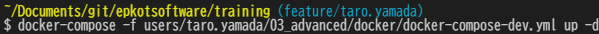
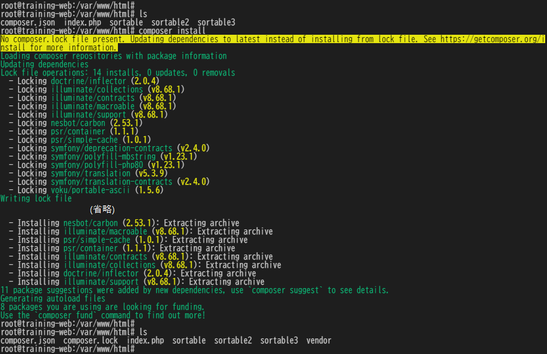

# フロントエンドエンジニア編課題

フロントエンドエンジニア編の課題を以下にアップしましょう。

- ブランチ名: `feature/{★ユーザー名}`
- 提出先パス: [`users/{★ユーザー名}/03_advanced/htdocs/`](./htdocs/)

## PHP開発環境

CBCではMAMP、XAMPPを使用して環境を作っていますが  
Dockerを使って環境を構築します。  
PHPのDB接続設定等も異なりますのでご注意ください。

### Docker

Dockerインストール後に [03_advanced/docker/docker-compose-dev.yml](./docker/docker-compose-dev.yml) を指定して `docker-compose` を実行します。  
カレントディレクトリの場所によりパスの指定が変わります。  
コマンドは以下になります。  

```bash
# ■ Git Bash・PowerShell等で実行
# docker-compose-dev.yml ファイルを指定して実行
docker-compose -f users/{★ユーザー名}/03_advanced/docker/docker-compose-dev.yml up -d
```

- メールアドレスが「`"taro.yamada@epkotsoftware.co.jp`」、カレントディレクトリが「`training`」の例
  - 

#### 確認

- WEB ([htdocs](./htdocs/) 内に置いてあるPHPファイルが実行されます。)
  - <http://localhost:8001/index.php>
  - <http://localhost:8001/sortable2/index.php>
  - <http://localhost:8001/sortable3/index.php>
- phpMyAdmin
  - <http://localhost:8888>

#### 使用しているイメージについて

Dockerで使用しているイメージは以下になります。  
`docker-compose`コマンドにより既に入っています。  
phpMyAdmin については必須ではありませんが  
CBCの研修内容にあわせて追加しています。

- PHP (`php:<version>-apache`)
  - <https://hub.docker.com/_/php?tab=tags>
  - composer (マルチステージビルドで使用しています)
    - <https://hub.docker.com/_/composer?tab=tags>
- MySQL
  - <https://hub.docker.com/_/mysql?tab=tags>
- phpMyAdmin
  - <https://hub.docker.com/r/phpmyadmin/phpmyadmin/tags>

### SQLクライアント

導入は任意です。  
無料、汎用的に使える、SQL自動生成、ER図作成等も出来る `A5:SQL Mk-2` がおすすめです。  

- `A5:SQL Mk-2`
  - <https://a5m2.mmatsubara.com/>
- 接続情報
  - ホスト名: `localhost`
  - ユーザーID: `root`
  - パスワード: `root`
  - ポート番号: `3306`

## PHP

研修を進めていくと`PDO`について触れます。  
PDO設定 接続情報は[`.env`](./docker/.env)に記載しています。  
**※ CBCと`host`の値が異なるので注意。**

```php
define('DB_DNS', 'mysql:host=mysql; dbname={★DB名}; charset=utf8'); // host = .env「DB_HOST_NAME」の値
define('DB_USER', 'root');
define('DB_PASSWORD', 'root'); // .env 「DB_ROOT_PASSWORD」の値

$dbh = new PDO(DB_DNS, DB_USER, DB_PASSWORD);
```

## 操作

### DB Server

MySQL をコマンドで実行可能。

- コマンドオプションを使用した MySQL Server への接続
  - <https://dev.mysql.com/doc/refman/8.0/ja/connecting.html>

```bash
# ■ Git Bash・PowerShell等で実行
docker exec -it training-mysql bash
```

```bash
# ■ Git Bash・PowerShell等で実行（training-mysql内）
mysql -u root -proot
```

ログアウトは`exit`コマンドを実行してください。

### WEB Server

PHPをコマンドで実行してみたり、Linuxのコマンド練習等にお使いください。  
研修外ですが `composer`・`vim`(vi コマンドが使えるようになっている)等もインストールしてあります。

```bash
# ■ Git Bash・PowerShell等で実行
docker exec -it training-web bash
```

ログアウトは`exit`コマンドを実行してください。

---

#### composer

**こちらはPHP課題が終わった後に任意で学習してください。**

- PHPのライブラリ管理ツール「Composer」入門
  - <https://weblabo.oscasierra.net/php-composer-1/>

[htdocs](./htdocs) の直下に、「`composer.json`」を配置し  
「`composer install`」コマンドを実行すると  
「`composer.lock`」ファイルが出来て、「`vendor`」ディレクトリにパッケージが格納されます。  
基本は「`vendor`」ディレクトリはGit管理外（コミット対象外）と  
チーム開発をする際は各自、`composer install`を行います。



- パッケージは以下で検索が出来ます。
  - <https://packagist.org/>

##### 例

Laravelというフレームワークにも使われている
`illuminate/support`というパッケージをインストールします。

- <https://packagist.org/packages/illuminate/support>

###### ■ composer.json

- バージョンの指定方法については以下
  - <https://qiita.com/ritukiii/items/7bb73fd8e383fb350a1d>

```json
{
    "require": {
        "illuminate/support": "^8.68"
    }
}
```

###### ■ index.php

Carbon(日時操作が出来る) と Collection(配列操作が出来る) を使ってみましょう。

```php
<?php
require_once "vendor/autoload.php";

echo "<pre>";
var_dump(Carbon\Carbon::now());
echo "</pre><pre>";
var_dump(collect(["a", "b", "c"]));
echo "</pre>";
```

- 上記を実行すると `Carbon\Carbon` と `Illuminate\Support\Collection` が使えることがわかります。

```bash
# コマンドでindex.phpを実行する。
php index.php
```

```bash
root@training-web:/var/www/html# php index.php
<pre>object(Carbon\Carbon)#3 (19) {
  ["endOfTime":protected]=>
  bool(false)
  ["startOfTime":protected]=>
  bool(false)
  ["constructedObjectId":protected]=>
  string(32) "00000000746bb00a000000004f0848dd"
  ["localMonthsOverflow":protected]=>
  NULL
  ["localYearsOverflow":protected]=>
  NULL
  ["localStrictModeEnabled":protected]=>
  NULL
  ["localHumanDiffOptions":protected]=>
  NULL
  ["localToStringFormat":protected]=>
  NULL
  ["localSerializer":protected]=>
  NULL
  ["localMacros":protected]=>
  NULL
  ["localGenericMacros":protected]=>
  NULL
  ["localFormatFunction":protected]=>
  NULL
  ["localTranslator":protected]=>
  NULL
  ["dumpProperties":protected]=>
  array(3) {
    [0]=>
    string(4) "date"
    [1]=>
    string(13) "timezone_type"
    [2]=>
    string(8) "timezone"
  }
  ["dumpLocale":protected]=>
  NULL
  ["dumpDateProperties":protected]=>
  NULL
  ["date"]=>
  string(26) "2021-10-29 16:24:27.059593"
  ["timezone_type"]=>
  int(3)
  ["timezone"]=>
  string(10) "Asia/Tokyo"
}
</pre><pre>object(Illuminate\Support\Collection)#3 (2) {
  ["items":protected]=>
  array(3) {
    [0]=>
    string(1) "a"
    [1]=>
    string(1) "b"
    [2]=>
    string(1) "c"
  }
  ["escapeWhenCastingToString":protected]=>
  bool(false)
}
</pre>root@training-web:/var/www/html# 
```
